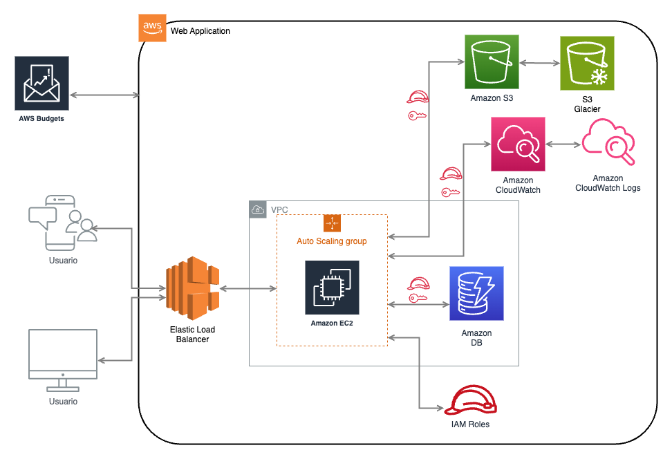

Part 1: Designing Cloud Infrastructure

* Para *Amazon EC2 (Elastic Compute Cloud)* se usaría el servicio *Amazon EC2 Auto Scaling* para así asegurar la escalabilidad de la aplicación, ya que esto permitirá agregar o eliminar instancias automáticamente según la demanda del tráfico.
* Respecto a *Amazon S3 (Simple Storage Service)* se deberán configurar buckets S3 con acceso restringido a través de políticas IAM para garantizar que solo las instancias y usuarios autorizados tengan acceso.
* Se debe definir una *VPC (Virtual Private Cloud)* que nos permite proteger y aislar el acceso a los buckets, definiendo que para las instancias EC2 que requieren acceso a Internet (servidores web) serán públicas y para las bases de datos o instancias que no deban estar excpuestas a Internet serán privadas.
* Se debe configurar un *ELB (Elastic Load Balancer)* para mejorar la disponibilidad distribuyendo el tráfico.
* Por último se deberá definir *Amazon RDS* para configurar, administrar y escalar una instancia de base de datos relacional en la nube. Habilitando alguno de los 6 motores de bases de datos.

Part 2: IAM Configuration

Existirán 4 roles asegurando el *Principio de Privilegio Mínimo* (permisos estrictamente necesarios para realizar sus tareas)
  * Desarrolladores:
	Estos tendrán acceso a servicios de desarrollo como EC2(completo en ambientes de desarrollo) y S3(lectura/escritura), además de tener acceso a CloudWatch para llevar el monitoreo.
  * Administradores:
	Estos tendrán acceso completo a todos los servicios de AWS (EC2, RDS, VPC, IAM, etc.) para la gestión de la infraestructura pero, con restricciones de acceso a recursos específicos en producción.
  * Instancias EC2:
	Estos tendrán acceso limitado a recursos necesarios para la ejecución de la aplicación. A S3 para lectura de archivos estáticos y escritura (si así se requiere), además de acceso restringido a la base de datos en RDS.
  * Usuarios de producción:
	Estos tendrán acceso limitado a servicios como RDS o EC2 según las necesidades operativas. Además de tener acceso a servicios específicos para tareas operativas como reiniciar instancias EC2 o hacer respaldos de RDS.

Part 3: Resource Management Strategy

* *Auto Scaling*:
	* Se debe configurar para las instancias EC2 según métricas como el uso de CPU o la cantidad de conexiones entrantes, permitiendo que la infraestructura crezca o disminuya automáticamente según la demanda, evitando costos innecesarios y mejorando la capacidad de respuesta.
* *Elastic Load Balancer (ELB)*:
	* Se debe utilizar para distribuir el tráfico entre las instancias EC2 de manera equilibrada. Lo que permitirá asegurar el alta disponibilidad y resiliencia ante fallos de alguna instancia.
* AWS Budgets:
	* Se establecerán alertas si se exceden los límites establecidos, teniendo previamente definido el presupuestos de costos para los diferentes servicios de AWS.
	* De ser necesario se deberá configurar almacenamiento S3 con políticas de ciclo de vida para archivar datos antiguos en S3 Glacier, reduciendo así los costos de almacenamiento a largo plazo.

Part 4: Theoretical Implementation

Part 5: Discussion and Evaluation
* Elección de servicios y su interacción:
	* EC2 y RDS proporcionan los recursos y almacenamiento necesarios para ejecutar y gestionar la aplicación web. 
    * Usar ELB asegura la distribución del tráfico y la alta disponibilidad.
	* S3 es ideal para almacenar archivos estáticos, y su integración con EC2 permite un acceso rápido y eficiente a los recursos.
	* VPC ofrece la infraestructura de red necesaria para mantener una comunicación segura y privada entre los componentes.
* Contribución de las políticas IAM:
	* Las políticas IAM definidas aplican el principio de privilegio mínimo, lo que limita el acceso solo a los recursos necesarios para cada rol. Esto reduce el riesgo de accesos no autorizados y mejora la seguridad general.
* Revisión de la estrategia de gestión de recursos:
	* La implementación de Auto Scaling y Elastic Load Balancer garantiza que la aplicación pueda manejar picos de tráfico sin necesidad de intervención manual.
	* El uso de AWS Budgets asegura que los costos se mantengan dentro de los límites establecidos, y las instancias reservadas y las políticas de ciclo de vida de S3 contribuyen a la optimización de costos a largo plazo.

