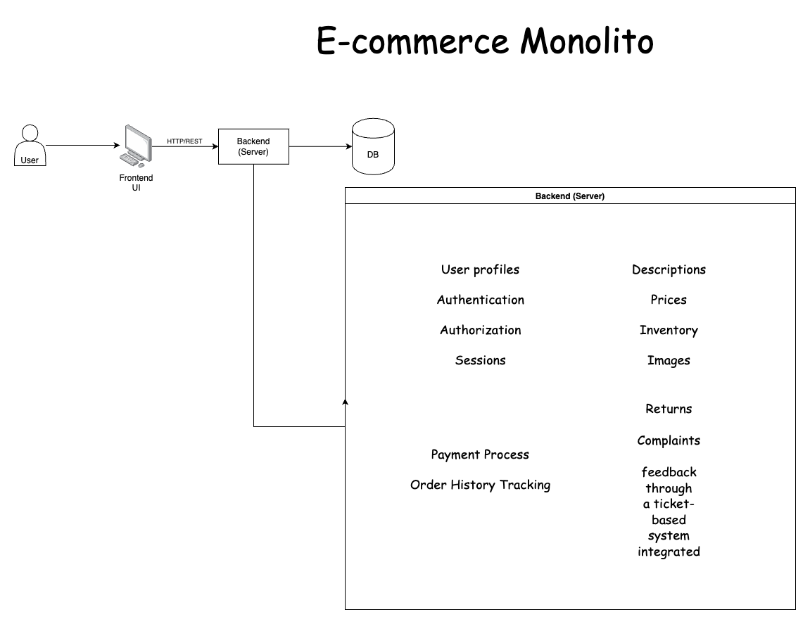
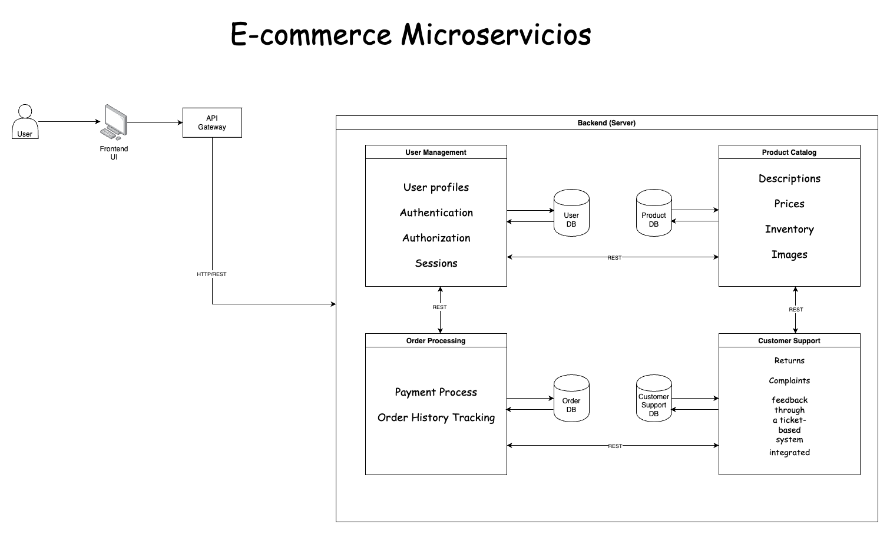

Diagrama de la Arquitectura Monolítica de un e-commerce

a) Esquema de Arquitectura de Microservicios

1. Diagrama (Microservicios Propuestos)

2. Flujo de comunicación:
   * Los microservicios se comunican entre sí usando APIs RESTful.
   * Cada servicio tiene una base de datos independiente, lo que facilita la escalabilidad y la resiliencia del sistema.
   * Los servicios deben manejar la consistencia eventual (eventual consistency) en lugar de una consistencia estricta (CQRS (Command Query Responsibility Segregation)).
   * Para la interfaz de usuario, el frontend puede comunicarse directamente con los microservicios a través de un API Gateway, el cual se encarga de redirigir las solicitudes a los servicios correspondientes.

b) Plan de Migración Detallado
1. Prioridades de migración de servicios:
	* Fase 1: Migración del servicio de usuarios (gestión de autenticación, perfiles).
	* Fase 2: Migración del catálogo de productos.
	* Fase 3: Migración de procesamiento de pedidos.
	* Fase 4: Migración del servicio de soporte al cliente.
2. Estrategia para manejar dependencias de datos:
	* Durante la migración, se recomienda implementar una base de datos compartida temporal que mantenga la sincronización entre el sistema monolítico y los microservicios.
	* En cada fase de migración, los datos se deben replicar entre el monolito y el microservicio correspondiente. Se pueden utilizar eventos de sincronización para mantener la coherencia entre las bases de datos.
	* Se debe realizar una migración gradual de la base de datos relacional a bases de datos específicas de cada microservicio.
3. Proceso de migración de la base de datos:
	* Paso 1: Identificar las tablas y relaciones críticas para cada microservicio. Se divide la base de datos monolítica en varias bases de datos específicas para cada servicio.
	* Paso 2: Implementar la lógica de migración de datos utilizando herramientas como ETL (Extract, Transform, Load) o mediante replicación de datos en tiempo real.
	* Paso 3: Asegurar que durante el proceso de migración, ambas bases de datos (la monolítica y la de microservicios) sean consistentes.
	* Paso 4: Realizar pruebas continuas para asegurar que no se pierdan datos y que los servicios puedan acceder a la información necesaria sin problemas.
	* Paso 5: Desactivar la base de datos monolítica una vez que todos los servicios hayan migrado correctamente y los microservicios estén funcionando de manera independiente.

c) Informe de Reflexión
Desafíos enfrentados en el diseño y decisiones de migración:
1. Desacoplamiento de funcionalidades: Migrar de una arquitectura monolítica a una de microservicios implica un cambio de mentalidad considerable. Es necesario dividir un sistema que anteriormente era un bloque único, lo que requiere un diseño detallado para garantizar que cada microservicio sea autónomo y no dependa de otros de forma excesiva.
2. Manejo de la consistencia de datos: En una base de datos monolítica es más sencillo garantizar la consistencia transaccional. Sin embargo, al pasar a microservicios con bases de datos distribuidas, se complica el mantenimiento de la consistencia entre los diferentes servicios. Aquí es crucial adoptar patrones como eventual consistency y tener un sistema robusto de comunicación entre servicios.
3. Desafíos de escalabilidad y rendimiento: Aunque los microservicios permiten escalar cada componente de manera independiente, esto también introduce complejidad en términos de gestión de la infraestructura, redes y balanceo de carga. Los equipos deben estar preparados para gestionar la comunicación inter-servicios de forma eficiente, evitando problemas de latencia o sobrecarga.
4. Pruebas y validación: La migración de una base de datos monolítica a un entorno distribuido requiere un enfoque más riguroso de pruebas, ya que los microservicios interactúan a través de APIs y mensajes. Las pruebas de integración y de aceptación deben estar bien estructuradas para evitar errores en el flujo de datos entre servicios.
5. Planificación del tiempo de migración: La migración debe hacerse de forma gradual y controlada para evitar interrupciones en la operativa del negocio. Se deben crear mecanismos para ejecutar la migración sin afectar la experiencia del usuario final y asegurando que los servicios monolíticos y los microservicios puedan coexistir temporalmente.